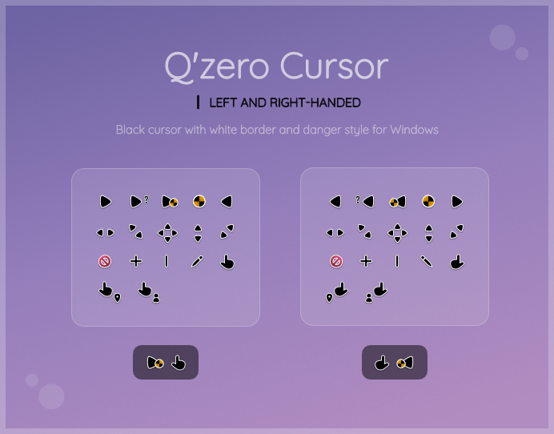

 

<h1 align="center">Q'zero Cursor</h1>

Black cursor with danger style (left and right-handed) for Windows.

 

 

Q'zero includes two sets: left and right-handed for better accessibility. It's created to be used on light or dark backgrounds, plus the waiting (danger) circle rotates.

When using the left-handed version you will need to change the primary mouse button in Windows settings.

Made with 🤍 under [MIT LICENSE](LICENSE)
 

 

## 📑 Source (English)
There are three formats as a source; the main one is `PNG` since this type of file was used to create the cursors and despite not being editable, you can work on them, an example is modifying the danger circle. You can also add them to websites or applications that require a raster image.

The next two are editable, one of these is the `SVG` format which does not include shadows since those were created non-vectorial. The last one is not possible to open with any software but I am sharing it because it is the original file: `afdesign` for Affinity Designer v2 (includes single object groups or layers in gray and yellow color, but this helps to convert to SVG).

 

### Convert editables to left-handed version

1. Select the **Backgrounds** and **Q'zero Cursor** layers at the same time and then click the *Flip Horizontal* button.

2. Expand the **Help** cursor group and flip the question mark indicated.

3. Export each cursor in PNG. **Work** and **Busy** include an animation for 8, don't forget to expand the groups and activate each danger circle one by one as indicated in the sequence.

 

### Convert afdesign to SVG

1. Right click on the **Pointer** cursor and choose the option of all the same label color, press the *FX* icon in the bottom bar (next to the *Adjustments* icon) and deactivate the *Outer shadow*.

2. Activate the visibility of all cursors and backgrounds. Expand the **Work** cursor group, right click on **w-8** and select all of the same label color, turn on their visibility to show the missing objects.

4. Export it as SVG. In the *Rasterize* option choose *Nothing*, then look for *Flatten transforms* and make sure to activate the box.

5. Edit the SVG version in a program like Inkscape, hide all the elements except for the purple background and the **Work** cursor with the danger circle **w-1**.

6. Rename the main layer to *Q'zero Cursor*, expand **Help** and change the hyphens to spaces in *Flip for Left*. Finally lock the backgrounds layer and save to overwrite.

 

### Convert PNG's to cursor

You can do it with your favorite editor, in this case the indications are only with animated cursors.

The animation of the **Busy** cursor must be **7s/60** (the sequence of the frames are indicated in the name) and **Work** must be **8s/60**. If you need to know where to place the Hot Spot just open an existing cursor to see the coordinates.

 

### Release ZIP

To finish, all you have to do is rename the *cursor* folder to *Q'zero Cursor* and add it to a ZIP file. You can also do it automatically by running the **zip with 7zip.bat** file, it only works with [7zip](https://www.7-zip.org/).
 

 

## 📑 Source (Spanish)
Existen tres formatos como fuente; el principal es `PNG` puesto que este tipo de archivo se utilizó para crear los cursores y a pesar de no ser editable, puedes trabajar sobre estos, un ejemplo es modificando del círculo de peligro. También puedes agregarlos a sitios web o aplicaciones que requieran de una imagen rasterizada.

Los dos siguientes son editables, uno de estos es el formato `SVG` que no incluye sombras ya que esas fueron creadas de manera no-vectorial. El último no es posible abrirlo con cualquier software pero lo comparto porque es el archivo original: `afdesign` para Affinity Designer v2 (incluye grupos de un solo objeto o capas en color gris y amarillo, pero esto ayuda a convertirlo a SVG).

 

### Convertir editables a la versión zurda

1. Selecciona las capas **Backgrounds** y **Q'zero Cursor** al mismo tiempo y después cliquea el botón de *Voltear horizontalmente*.

2. Expande el grupo del cursor **Help** y voltea el signo de interrogación que se indica.

3. Exporta cada cursor en PNG. **Work** y **Busy** incluyen una animación para 8, no olvides expandir los grupos y activar cada círculo de peligro uno por uno como se indica en la secuencia.

 

### Convertir afdesign a SVG

1. Haz clic derecho en el cursor **Pointer** y elige la opción de todos los del mismo color de etiqueta, presiona el icono de *FX* de la barra inferior (junto al icono de *Ajustes*) y desactiva la *Sombra exterior*.

2. Activa la visibilidad de todos los cursores y los fondos. Expande el grupo del cursor **Work**, da clic derecho sobre **w-8** y selecciona todos los del mismo color de etiqueta, activa su visibilidad para que se muestren los objetos faltantes.

4. Expórtalo como SVG. En la opción *Rasterizar* elige *Nada*, posteriormente busca *Acoplar transformaciones* y asegurate de activar la casilla.

5. Edita la versión SVG en un programa como Inkscape, esconde todos los elementos a excepción del fondo morado y el cursor **Work** con el círculo de peligro **w-1**.

6. Renombra la capa principal a *Q'zero Cursor*, expande **Help** y cambia los guiones por espacios en *Flip for Left*. Finalmente bloquea la capa de fondos y guarda para sobrescribir.

 

### Convertir PNG's a cursor

Puedes hacerlo con tu editor favorito, en esta caso las indicaciones son únicamente con los cursores animados.

La animación del cursor **Busy** debe ser de **7s/60** (la secuencia de los frames están indicados en el nombre) y **Work** de **8s/60**. Si necesitas saber dónde colocar el Hot Spot solo abre un cursor existente para ver las coordenadas.

 

### Release ZIP

Para finalizar, únicamente deberás renombrar la carpeta *cursor* por *Q'zero Cursor* y añadirla a un archivo ZIP. También puedes hacerlo automáticamente ejecutando el archivo **zip with 7zip.bat**, únicamente funciona con [7zip](https://www.7-zip.org/).
 

 

## Contributing
Big changes may not be made anymore since I have modified this cursor for about a year. In any case, sets with new designs are welcome.

If you have any request, you can let me know.