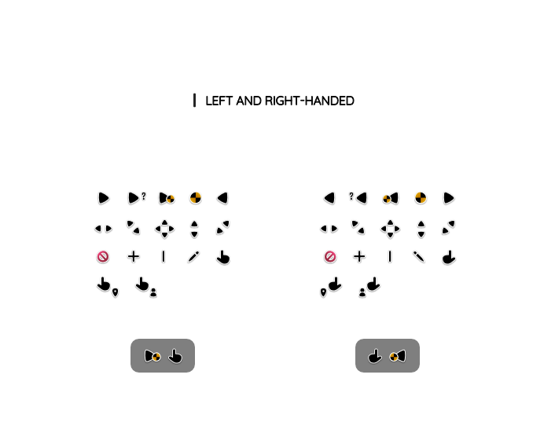

<picture></picture>

Q'zero includes two sets: left and right-handed for better accessibility. It's created to be used on light or dark backgrounds, plus the waiting (danger) circle rotates.

When using the left-handed version you will need to change the primary mouse button in Windows settings.

Made with 🖤 under [MIT License](https://github.com/genesistoxical/qzero-cursor/blob/master/LICENSE).